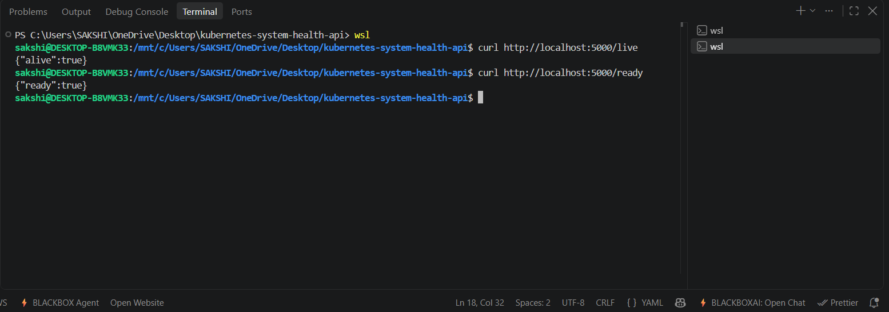
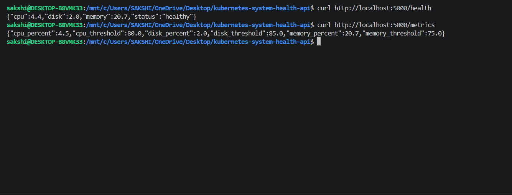

# Kubernetes System Health API

A production-style DevOps project that deploys a Python Flask system health API using Docker and Kubernetes, with automated testing, GitHub Actions CI/CD, ConfigMaps, health probes, resource management, and shell-script automation.

The project demonstrates how a containerized application can be built, tested, deployed, monitored through Kubernetes health checks, and accessed through a NodePort service.

---

## Architecture

```text
                         KUBERNETES SYSTEM HEALTH API

                              User / Browser
                                  / curl
                                    |
                                    | HTTP :30007
                                    v
                         +-----------------------+
                         |   Kubernetes Service  |
                         |       NodePort        |
                         |        :30007         |
                         +-----------+-----------+
                                     |
                                     v
                    +----------------------------------+
                    |       Kubernetes Deployment      |
                    |    system-health-deployment      |
                    |          Replicas: 2              |
                    +---------------+------------------+
                                    |
                         +----------+----------+
                         |                     |
                         v                     v
                  +-------------+       +-------------+
                  |    Pod 1    |       |    Pod 2    |
                  |             |       |             |
                  |  Gunicorn   |       |  Gunicorn   |
                  |  + Flask    |       |  + Flask    |
                  +------+------+       +------+------+
                         |                     |
                         +----------+----------+
                                    |
                                    v
                              +-----------+
                              |   psutil  |
                              |           |
                              | CPU       |
                              | Memory    |
                              | Disk      |
                              +-----------+


              +--------------------+     +----------------------+
              |      ConfigMap     |     |    Health Probes     |
              |  health-thresholds |     |                      |
              |                    |     | /live  -> Liveness   |
              | CPU_THRESHOLD      |     | /ready -> Readiness  |
              | MEMORY_THRESHOLD   |     |                      |
              | DISK_THRESHOLD     |     +----------------------+
              | DISK_THRESHOLD     |
              +--------------------+

                         API ENDPOINTS

             /health    /metrics    /live    /ready
                |           |          |        |
             Health      Metrics    Liveness Readiness
              Status    +Threshold    Check     Check
```

---

## Tech Stack

| Layer              | Technology     |
| ------------------ | -------------- |
| Language           | Python 3.10    |
| Framework          | Flask 2.3.3    |
| Application Server | Gunicorn       |
| Containerization   | Docker         |
| Orchestration      | Kubernetes     |
| CI/CD              | GitHub Actions |
| Testing            | pytest         |
| Scripting          | Bash           |
| System Metrics     | psutil         |

---

## Project Overview

The application exposes system health information through REST API endpoints.

The Flask application collects CPU, memory, and disk usage using `psutil`. The application is containerized using Docker and deployed to Kubernetes using a Deployment, Service, and ConfigMap.

### DevOps concepts demonstrated

* Docker image creation
* Containerized Python application
* Kubernetes Deployments
* Kubernetes Services
* NodePort networking
* Liveness and readiness probes
* ConfigMap-based configuration
* Resource requests and limits
* Rolling deployments
* Shell scripting
* Automated testing with pytest
* GitHub Actions CI/CD
* Gunicorn production application server

---

## API Endpoints

| Endpoint   | Purpose                                                    |
| ---------- | ---------------------------------------------------------- |
| `/health`  | Returns CPU, memory, disk usage, and overall health status |
| `/metrics` | Returns system metrics and configured threshold values     |
| `/live`    | Liveness endpoint used by Kubernetes                       |
| `/ready`   | Readiness endpoint used by Kubernetes                      |

### Example `/health` response

```json
{
  "cpu": 12.5,
  "memory": 45.2,
  "disk": 22.1,
  "status": "healthy"
}
```

---

## Kubernetes Configuration

### Deployment

The application runs using a Kubernetes Deployment with **2 replicas**.

```text
Deployment
    |
    +-- Pod 1
    |
    +-- Pod 2
```

Running multiple replicas provides basic application redundancy and allows Kubernetes to distribute requests between available pods.

### Service

The application is exposed using a **NodePort Service**.

```text
Client
   |
   v
NodePort :30007
   |
   v
Pods :5000
```

### ConfigMap

Health thresholds are externalized using a Kubernetes ConfigMap instead of hardcoding them into the application.

Example configuration:

```text
CPU_THRESHOLD=85
MEMORY_THRESHOLD=85
DISK_THRESHOLD=90
```

This allows configuration to be changed without modifying the application source code.

---

## Health Probes

The application uses separate endpoints for Kubernetes health checks:

```text
/live  -> Liveness Probe
/ready -> Readiness Probe
```

### Liveness Probe

The `/live` endpoint tells Kubernetes whether the application process is alive.

If the application becomes unhealthy and fails the liveness probe repeatedly, Kubernetes can restart the container.

### Readiness Probe

The `/ready` endpoint tells Kubernetes whether the application is ready to receive traffic.

If the readiness probe fails, Kubernetes removes the pod from Service endpoints until it becomes ready again.

Dedicated endpoints are used instead of `/health` so that Kubernetes health checks remain simple and independent from the application's detailed health/metrics logic.

---

## Resource Management

The Kubernetes Deployment defines resource requests and limits for the application container.

This demonstrates how Kubernetes can control and manage the resources available to workloads.

```text
Resource Requests
        |
        v
Minimum resources expected by the container

Resource Limits
        |
        v
Maximum resources the container can consume
```

---

## Project Structure

```text
kubernetes-system-health-api/
│
├── .github/
│   └── workflows/
│       └── deploy.yml
│
├── k8s/
│   ├── configmap.yaml
│   ├── deployment.yaml
│   └── service.yaml
│
├── scripts/
│   ├── build-image.sh
│   ├── deploy-k8s.sh
│   └── check-health.sh
│
├── screenshots/
│   ├── test-cases.png
│   ├── pods.png
│   ├── service.png
│   ├── live and ready endpoints.png
│   └── metrics and health endpoints.png
│
├── app.py
├── Dockerfile
├── README.md
├── requirements.txt
├── requirements-dev.txt
└── test_app.py
```

---

## Local Docker Setup

### Build the Docker image

```bash
docker build -t system-health-api:latest .
```

### Run the container

```bash
docker run -p 5000:5000 system-health-api:latest
```

### Test the API

```bash
curl http://localhost:5000/health
curl http://localhost:5000/metrics
curl http://localhost:5000/live
curl http://localhost:5000/ready
```

---

## Kubernetes Deployment

### Apply the manifests

```bash
kubectl apply -f k8s/configmap.yaml
kubectl apply -f k8s/deployment.yaml
kubectl apply -f k8s/service.yaml
```

### Verify the deployment

```bash
kubectl get pods
kubectl get svc
kubectl rollout status deployment/system-health-deployment
```

### Test through NodePort

```bash
curl http://localhost:30007/health
curl http://localhost:30007/metrics
```

---

## Shell Scripts

The `scripts/` directory automates common development and deployment tasks.

### Build Docker image

```bash
bash scripts/build-image.sh
```

### Deploy to Kubernetes

```bash
bash scripts/deploy-k8s.sh
```

### Check application health

```bash
bash scripts/check-health.sh
```

### Check a custom health URL

```bash
bash scripts/check-health.sh http://localhost:30007/health
```

---

## Updating ConfigMap Values

Threshold values are stored in:

```text
k8s/configmap.yaml
```

After changing the values, apply the updated ConfigMap:

```bash
kubectl apply -f k8s/configmap.yaml
```

Restart the Deployment so the pods pick up the updated environment variables:

```bash
kubectl rollout restart deployment/system-health-deployment
```

---

## Automated Testing

Development dependencies are installed using:

```bash
pip install -r requirements-dev.txt
```

Run the test suite:

```bash
pytest test_app.py -v
```

### Tests validate

* API endpoint availability
* JSON response structure
* Health status responses
* Liveness endpoint
* Readiness endpoint
* Configured threshold values
* Healthy and unhealthy application states
* Mocked system metrics

---

## CI/CD Pipeline

GitHub Actions automates the application pipeline.

```text
Git Push
   |
   v
+---------+
|  Test   |
| pytest  |
+----+----+
     |
     v
+---------+
|  Build  |
| Docker  |
+----+----+
     |
     v
+---------+
| Deploy  |
|   K8s   |
+---------+
```

### 1. Test

Runs the pytest test suite.

The pipeline stops if the tests fail.

### 2. Build

Builds the Docker image and pushes it to Docker Hub.

The image is tagged with:

```text
latest
<git-commit-sha>
```

### 3. Deploy

The Kubernetes deployment is updated with the newly built image.

Using the Git commit SHA makes each deployment traceable to a specific version of the source code.

---

## Docker Design

The Dockerfile uses:

* `python:3.10-slim` as the base image
* Gunicorn instead of Flask's development server
* Runtime dependencies from `requirements.txt`
* A non-root user
* Unbuffered Python output for cleaner container logs

Using Gunicorn provides a production-oriented WSGI server instead of relying on Flask's development server.

---

## Key Design Decisions

### Why use Gunicorn instead of Flask's development server?

Flask's built-in server is intended for development.

Gunicorn provides a production-oriented WSGI server and allows the application to run with worker processes.

---

### Why separate `/live` and `/ready`?

Liveness and readiness answer different questions.

```text
/live
  |
  +-- Is the application process alive?

/ready
  |
  +-- Is the application ready to receive traffic?
```

Keeping these checks separate makes Kubernetes health management clearer and avoids coupling probes to the application's main health/metrics logic.

---

### Why use a ConfigMap?

Configuration such as CPU, memory, and disk thresholds should not need to be hardcoded into the application.

The ConfigMap allows these values to be managed externally:

```text
Application Code
      +
ConfigMap
      |
      v
Environment Variables
      |
      v
Application
```

---

### Why use resource requests and limits?

Requests help Kubernetes determine the resources a workload needs.

Limits prevent a container from consuming unlimited resources on the node.

---

## Evidence

**Automated tests passing:**


**Kubernetes pods running successfully:**


**NodePort Service configured and running:**


**Liveness and readiness endpoints working:**



**Health and metrics endpoints returning responses:**



---

## Lessons Learned

* Kubernetes liveness and readiness probes should have dedicated endpoints.
* ConfigMaps allow configuration to be separated from application code.
* ConfigMap values provided as environment variables require pods to restart before updated values are loaded.
* Gunicorn is more appropriate for serving Flask applications in a production-style container.
* Resource requests and limits help control Kubernetes workload resource usage.
* Shell scripts reduce repetitive manual deployment tasks.
* CI/CD should fail early when automated tests fail.
* Git commit SHA image tags make deployments easier to trace and debug.

---

## Future Improvements

* [ ] Add Ingress support
* [ ] Add Helm chart
* [ ] Add Prometheus metrics
* [ ] Add Grafana dashboard
* [ ] Add Kubernetes Horizontal Pod Autoscaler
* [ ] Add container security scanning
* [ ] Add deployment rollback strategy
* [ ] Add Kubernetes secrets management
* [ ] Add monitoring and alerting
