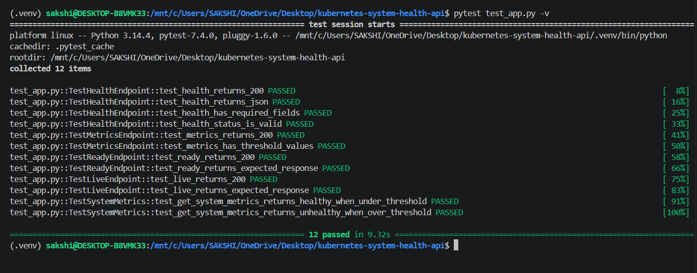
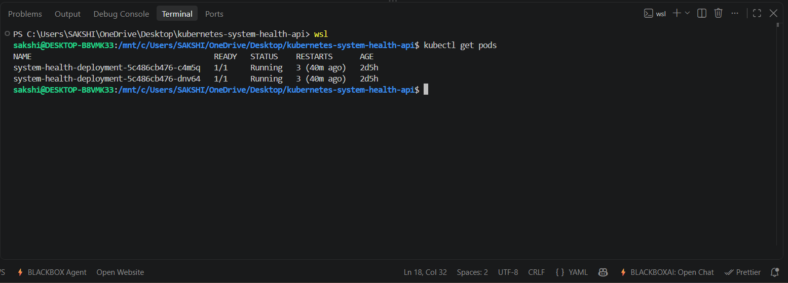
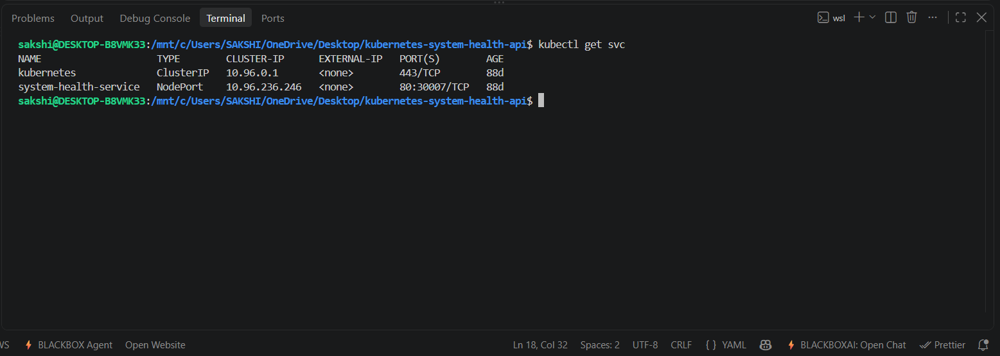

# Kubernetes System Health API

A production-style DevOps project that deploys a Python Flask system health API using Docker, Kubernetes, GitHub Actions, ConfigMaps, health probes, resource limits, shell scripts, and automated tests.

[](https://www.python.org/)
[](https://flask.palletsprojects.com/)
[](https://www.docker.com/)
[](https://kubernetes.io/)
[](https://github.com/features/actions)
[](LICENSE)

---

## Tech Stack

| Layer | Tools |
|---|---|
| Language | Python 3.10 |
| Framework | Flask + Gunicorn |
| Containerization | Docker |
| Orchestration | Kubernetes |
| CI/CD | GitHub Actions |
| Testing | pytest |
| Scripting | Bash |
| Metrics | psutil |

---

## Project Overview

This project exposes system health data through REST API endpoints. The application is containerized using Docker and deployed on Kubernetes using a Deployment, Service, and ConfigMap.

**Core DevOps concepts demonstrated:**

- Docker image creation and optimization
- Kubernetes application deployment
- Liveness and readiness probes
- ConfigMap-based configuration
- Resource requests and limits
- Shell scripting for automation
- GitHub Actions CI/CD pipeline
- Automated testing with pytest

---

## Architecture

```text
                         KUBERNETES SYSTEM HEALTH API
                                      |
                                      v
                         +-------------------------+
                         |     User / Browser      |
                         |          / curl          |
                         +------------+------------+
                                      |
                                      | HTTP :30007
                                      v
                         +-------------------------+
                         |   Kubernetes Service     |
                         |        NodePort         |
                         |        :30007            |
                         +------------+------------+
                                      |
                                      v
                 +-----------------------------------------+
                 |       Kubernetes Deployment             |
                 |    system-health-deployment             |
                 |          Replicas: 2                    |
                 +-------------------+---------------------+
                                     |
                        +------------+------------+
                        |                         |
                        v                         v
                 +-------------+           +-------------+
                 |    Pod 1    |           |    Pod 2    |
                 |             |           |             |
                 |  Gunicorn  |           |  Gunicorn  |
                 |  + Flask   |           |  + Flask    |
                 +------+------+           +------+------+
                        |                         |
                        +------------+------------+
                                     |
                                     v
                            +-----------------+
                            |     psutil      |
                            |                 |
                            | CPU / Memory    |
                            |      / Disk     |
                            +-----------------+

             +-------------------+     +-----------------------+
             |     ConfigMap     |     |    Health Probes      |
             | health-thresholds |     |                       |
             |                   |     | /live  -> Liveness    |
             | CPU_THRESHOLD     |     | /ready -> Readiness   |
             | MEMORY_THRESHOLD  |     |                       |
             | DISK_THRESHOLD    |     +-----------------------+
             +-------------------+

                         API ENDPOINTS
              +------------+------------+------------+
              |            |            |            |
              v            v            v            v
           /health      /metrics      /live        /ready
           Health       Metrics       Liveness     Readiness
           status       + thresholds  check        check

---
## Screenshots

### Test Cases



### Pods



### Service



### Live & Ready Endpoints


### Health & Metrics Endpoints


## API Endpoints

| Endpoint | Purpose |
|---|---|
| `/health` | Returns CPU, memory, disk usage, and health status |
| `/metrics` | Returns system metrics with configured threshold values |
| `/ready` | Readiness endpoint used by Kubernetes |
| `/live` | Liveness endpoint used by Kubernetes |

**Example `/health` response:**

```json
{
  "cpu": 12.5,
  "memory": 45.2,
  "disk": 22.1,
  "status": "healthy"
}
```

---

## Project Structure

```text
kubernetes-system-health-api/
├── .github/
│   └── workflows/
│       └── deploy.yml
├── k8s/
│   ├── configmap.yaml
│   ├── deployment.yaml
│   └── service.yaml
├── scripts/
│   ├── build-image.sh
│   ├── deploy-k8s.sh
│   └── check-health.sh
├── screenshots/
│   ├── test-cases.png
│   ├── pods.png
│   ├── service.png
│   ├── live and ready endpoints.png
│   └── metrics and health endpoints.png
├── app.py
├── Dockerfile
├── README.md
├── requirements.txt
├── requirements-dev.txt
└── test_app.py

---

## Local Docker Setup

**Build the Docker image:**

```bash
docker build -t system-health-api:latest .
```

**Run the container:**

```bash
docker run -p 5000:5000 system-health-api:latest
```

**Test the API:**

```bash
curl http://localhost:5000/health
curl http://localhost:5000/metrics
curl http://localhost:5000/live
curl http://localhost:5000/ready
```

---

## Kubernetes Deployment

**Apply the Kubernetes manifests:**

```bash
kubectl apply -f k8s/configmap.yaml
kubectl apply -f k8s/deployment.yaml
kubectl apply -f k8s/service.yaml
```

**Check pod and service status:**

```bash
kubectl get pods
kubectl get svc
kubectl rollout status deployment/system-health-deployment
```

**Test the API through NodePort:**

```bash
curl http://localhost:30007/health
curl http://localhost:30007/metrics
```

---

## Shell Scripts

The `scripts/` folder automates common DevOps tasks.

```bash
# Build Docker image
bash scripts/build-image.sh

# Deploy Kubernetes manifests
bash scripts/deploy-k8s.sh

# Check application health
bash scripts/check-health.sh

# Check health at a custom URL
bash scripts/check-health.sh http://localhost:30007/health
```

---

## Updating ConfigMap Values

Threshold values are stored in `k8s/configmap.yaml`. After making changes:

```bash
# Apply the updated ConfigMap
kubectl apply -f k8s/configmap.yaml

# Restart the deployment so pods pick up the new environment variables
kubectl rollout restart deployment/system-health-deployment
```

---

## Running Tests

**Install development dependencies:**

```bash
pip install -r requirements-dev.txt
```

**Run tests:**

```bash
pytest test_app.py -v
```

**The tests validate:**

- API endpoint availability
- JSON response structure
- Health status response
- Readiness and liveness endpoints
- Threshold values in metrics response
- Healthy and unhealthy status behavior using mocked system metrics

---

## CI/CD Pipeline

The GitHub Actions pipeline runs three stages on every push:

**1. Test**
Runs `pytest` before building the image. Pipeline fails immediately if any test fails.

**2. Build**
Builds the Docker image and pushes to Docker Hub with two tags:
- `latest`
- Git commit SHA

**3. Deploy**
Updates the Kubernetes deployment to use the Git commit SHA image tag and applies all manifests. Using the commit SHA makes every deployment traceable to the exact code version.

---

## Kubernetes Features Used

- Deployment with 2 replicas
- NodePort Service
- ConfigMap for threshold configuration
- Liveness probe via `/live`
- Readiness probe via `/ready`
- Resource requests and limits
- Rolling deployment strategy

---

## Docker Improvements

The Dockerfile uses:

- `python:3.10-slim` base image for a smaller footprint (~95 MB)
- Gunicorn instead of Flask development server
- Runtime-only dependencies from `requirements.txt`
- Non-root user for safer container execution
- Unbuffered Python logs for clean container logging

---

## Lessons Learned

- Kubernetes probes should use dedicated endpoints — not the main app route
- ConfigMaps help externalize configuration without rebuilding the Docker image
- ConfigMap values used as environment variables require a pod restart to take effect
- Git commit SHA image tags make deployments easier to trace and debug
- CI/CD pipelines should fail clearly at each stage — test, build, deploy
- Separating runtime and dev dependencies keeps Docker images lean
- Shell scripts reduce repetitive manual steps in local development

---

## Future Improvements

- [ ] Add Ingress support
- [ ] Add Helm chart
- [ ] Add Prometheus metrics endpoint
- [ ] Add Grafana dashboard
- [ ] Add Terraform-based infrastructure provisioning
- [ ] Add security scanning in CI/CD pipeline
